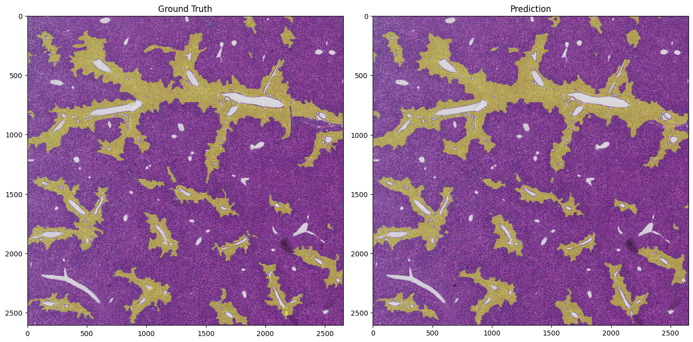
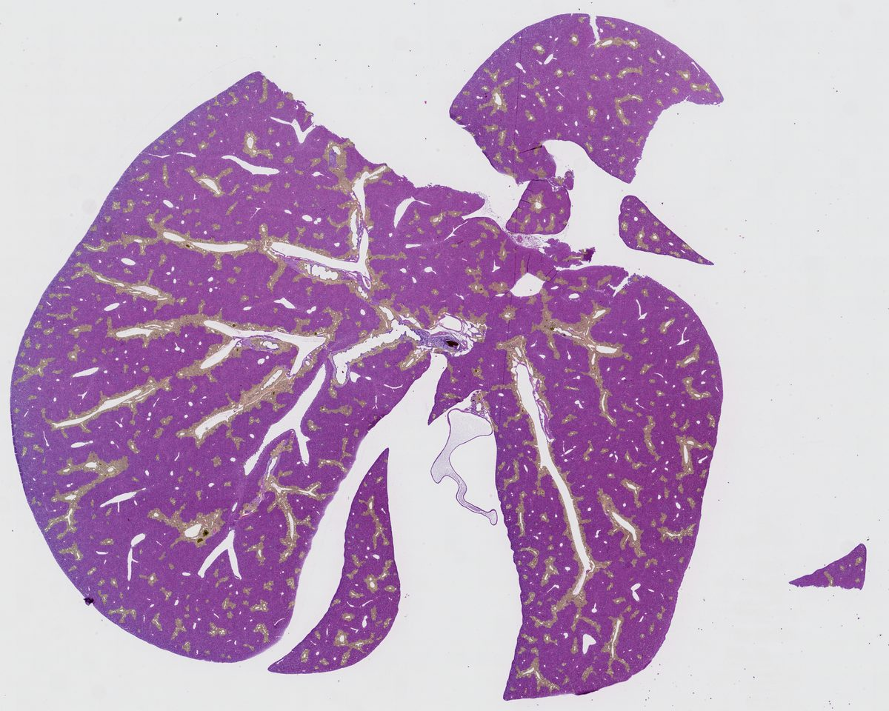

# ducknet-dr-segmentation

A [DUCK-Net](https://www.nature.com/articles/s41598-023-36940-5) implementation for automated segmentation of **ductular reactions (DR)** in H&E-stained murine liver histology slides.

The pipeline takes whole-slide images (`.ndpi`) plus QuPath GeoJSON annotations, downsamples and tiles them into image/mask pairs, trains a DUCK-Net segmentation model, and produces predicted DR masks (exportable back to GeoJSON for QuPath).


_Ground truth (left) vs model prediction (right) on a held-out ROI._

---

## Project Structure

```
ducknet-dr-segmentation/
├── data/
│   ├── raw/                  # source WSIs + QuPath GeoJSON annotations
│   │   ├── slides/           # *.ndpi whole-slide images
│   │   └── geojson/          # *.geojson exported from QuPath
│   ├── processed/            # downsampled images + rasterized masks
│   │   ├── images/
│   │   ├── masks/
│   │   └── metadata.csv
│   └── qupath/               # QuPath project (annotation source)
├── notebooks/                # exploratory notebooks (see below)
└── src/biliary_seg/
    ├── data/                 # loaders, patching, geometry, inference
    ├── models/ducknet/       # DUCK-Net (TF/Keras)
    ├── training/             # augmentations, losses, metrics, callbacks
    └── pipelines/            # preprocess_slides.py, train_model.py
```

### Notebooks

| Notebook                          | Purpose                                                                                      |
| --------------------------------- | -------------------------------------------------------------------------------------------- |
| `01. Processing Slides.ipynb`     | Run the preprocessing pipeline over raw slides + GeoJSON.                                    |
| `02. Testing Augmentations.ipynb` | Visualise the training augmentation stack (incl. HED jitter).                                |
| `03. Predicting.ipynb`            | Load a trained model and predict DR masks on processed images, exporting results to GeoJSON. |

---

## Installation

Requires Python 3.10 and [OpenSlide](https://openslide.org/). The pinned versions in `requirements.txt` correspond to a TensorFlow 2.10 environment (the last TF release with native Windows GPU support).

```bash
pip install -r requirements.txt
```

---

## Usage

### 1. Preprocess slides

Place `.ndpi` files in `data/raw/slides/` and matching QuPath GeoJSON exports in `data/raw/geojson/` (same filename, different extension). Then:

```python
from biliary_seg.pipelines.preprocess_slides import parse_slide

parse_slide(
    slide_id="RG425",
    slide_path="data/raw/slides/RG425.ndpi",
    annotation_path="data/raw/geojson/RG425.geojson",
    output_dir="data/processed",
    downsample_factor=8,
    annotation_roi_tag="Field of Annotation",
)
```

This writes one image + mask per ROI to `data/processed/{images,masks}/` and updates `metadata.csv`.

### 2. Train

```bash
python -m biliary_seg.pipelines.train_model
```

Or call `train_model(...)` directly to override defaults:

```python
from biliary_seg.pipelines.train_model import train_model

train_model(
    data_dir="data/processed",
    image_size=(512, 512),
    batch_size=8,
    epochs=100,
    steps_per_epoch=2000,
    learning_rate=1e-4,
    ducknet_filters=17,
    checkpoint_dir="./checkpoints",
)
```

Training uses Dice loss, full-image validation (sliding window), and reduces LR on plateau while restoring the best-Dice weights.

### 3. Predict

```python
from biliary_seg.data.inference.predict import predict_mask
from biliary_seg.models.ducknet import DUCK_Net

model = DUCK_Net.create_model(img_height=512, img_width=512, input_chanels=3, out_classes=1, starting_filters=17)
model.load_weights("checkpoints/best_model.h5")

mask = predict_mask(image, model, image_size=(512, 512), window_overlap=0.35, threshold=0.5)
```

See `notebooks/03. Predicting.ipynb` for an end-to-end example, including exporting the predicted mask as a QuPath-compatible GeoJSON.


_Predicted DR mask overlaid on an unseen whole-slide image._

---

## Model

DUCK-Net is a U-Net-style architecture using stacked Dilated–Upsampling–Conv–Kernel (DUCK) blocks. See the original paper: _Dumitru et al., "Using DUCK-Net for polyp image segmentation," Scientific Reports (2023)_.
